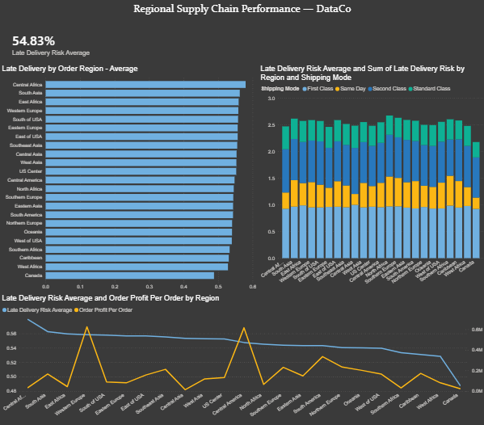

# Project 02 — Warehouse & Regional Performance Dashboard

## Overview
Analysis of 180,000+ orders across 23 global regions from the
DataCo Global Supply Chain dataset to identify regional delivery
performance patterns, shipping mode failures, and profit at risk
from systemic late delivery.

## Tools
- SQL Server (SSMS)
- Power BI

## Dataset
**Refined DataCo Supply Chain & Geospatial Dataset**
Source: Kaggle — aaumgupta
180,519 rows · Orders, shipments, products, customers, geospatial data
https://www.kaggle.com/datasets/aaumgupta/refined-dataco-supply-chain-geospatial-dataset

## Key Findings
- Late delivery is systemic across all 23 global regions (48–58%)
  — no region is being prioritized or protected
- First Class shipping fails at 92–100% late rate in every single
  region without exception — Central Asia hit 100%
- Western Europe ($625k) and Central America ($616k) are the top
  2 profit regions — both running at 55%+ late delivery rate
- $212k in First Class orders across top 2 regions operating at
  95% late rate — direct profit risk
- Standard Class is simultaneously the most reliable AND most
  profitable mode in every region globally
- Canada Same Day has the lowest late rate in the dataset (21%)
  but is the only mode operating at negative profit (-$1.83)
- Scheduled days field shows identical values across all 23 regions
  suggesting a static default rather than calculated SLA —
  potential data quality issue affecting all performance baselines

## Dashboard

## Business Recommendation
Discontinue or reprice First Class shipping globally. The mode
fails universally and generates less profit than Standard Class
despite commanding premium pricing. Audit the scheduled days
field for data integrity — every SLA metric in the operation
may be built on a flawed baseline.

## Queries
| File | Description |
|------|-------------|
| 1_regional_late_rate.sql | Late rate and order volume across all 23 regions |
| 2_late_rate_by_region_and_mode.sql | Late rate by region and shipping mode combined |
| 3_regional_profit.sql | Total profit and late rate by region |
| 4_profit_by_region_and_mode.sql | Profit breakdown by region and shipping mode |
